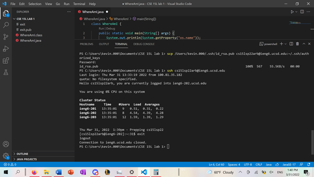
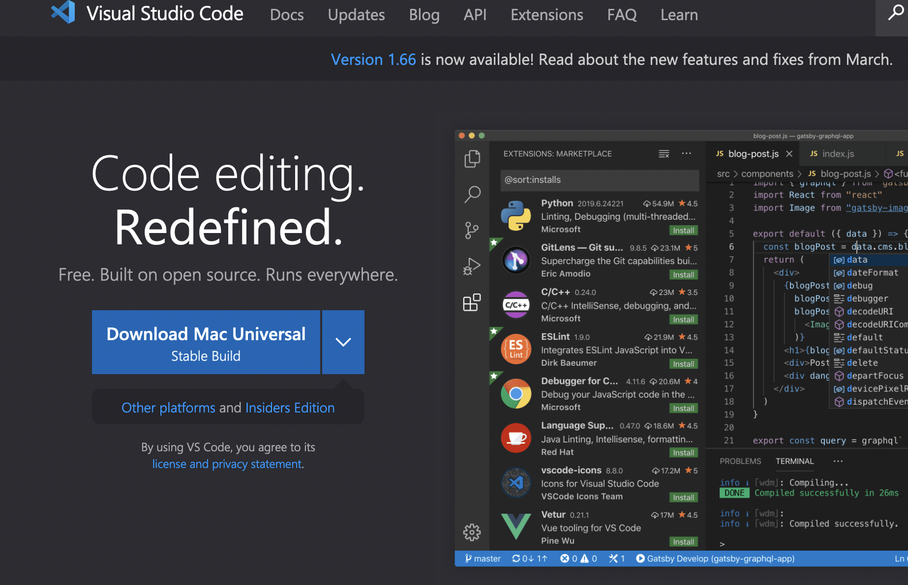

# How to Log into a Course-Specific Account on ieng6
Disclaimer: I got a new Macbook between the lab and the lab report, so the first step is for Mac while the rest is for Windows
## Step 1: Installing VScode 
 

To install VSCode, simply go to this [VSCode download link](https://code.visualstudio.com/) and click the Download Mac Univeral button. Then, just open the installer and drag the application to the application folder. 

## Step 2: Remotely Connecting

For Windows, you must install OpenSSH Client and OpenSSH Server by opening Settings, select Apps > Apps & Features, then select Optional Features. 

Then, on VSCode, type in 

`$ ssh cs15lsp22zz@ieng6.ucsd.edu`

and replace zz with the letters to your course-specific account.

 

Type yes to the options given and you should get this message in the terminal. 

## Step 3: Trying Some Commands

Try running these commands:

Just type them into your connected terminal to run these commands. Some of them might not work, but that is normal.

## Step 4: Moving Files with scp

Copy `scp WhereAmI.java cs15lsp22zz@ieng6.ucsd.edu:~/` (where zz is your course-specific account) into your computer's terminal, so not the remote connection. Then, remote connect to the server and use the command `ls` to copy the file over to the home directory. 

## Step 5: Setting an SSH key

On your computer terminal, copy this command: `$ ssh-keygen` and click enter until you get the keygen. Follow these extra steps for [Windows](https://docs.microsoft.com/en-us/windows-server/administration/openssh/openssh_keymanagement#user-key-generation).
Then connect to the server, type `mkdir .ssh`, log back into your computer, and enter `scp /Users/user-name/.ssh/id_rsa.pub
cs15lsp22zz@ieng6.ucsd.edu:~/.ssh/authorized_keys`.

## Step 6: Optimizing Remote Running

I used some shortcuts such as `;` to write multiple commands in one line. This would speed up the process since it runs everything at once. 