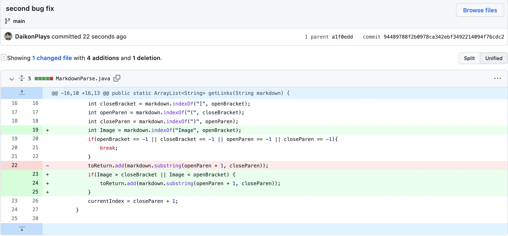
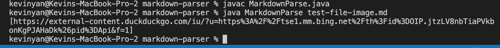
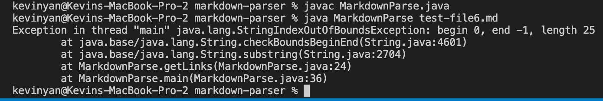

 
[Link to first test file](https://github.com/DaikonPlays/markdown-parser/blob/main/test-file.md)

The first error happens when there are extra space after the URL. This results in an infinite loop and will throw an outofmemory exception, which is resolved by breaking the while loop when there are no more brackets or parenthesis.

[Link to second test file](https://github.com/DaikonPlays/markdown-parser/blob/main/test-file-image.md)

The second error happens when there is an image link. While there is no error being thrown, the program shouldn't pull the image link because it isn't a URL to a website. This is resolved by only running the code when there isn't an image in the file. 

 
[Link to test 3](https://github.com/DaikonPlays/markdown-parser/blob/main/test-file6.md)

The third error happens when there are no parenthesis around the link. It throws an indexoutofbounds exception. To solve this, I check for parenthesis so that the new output would just be an empty array since there are no links. 