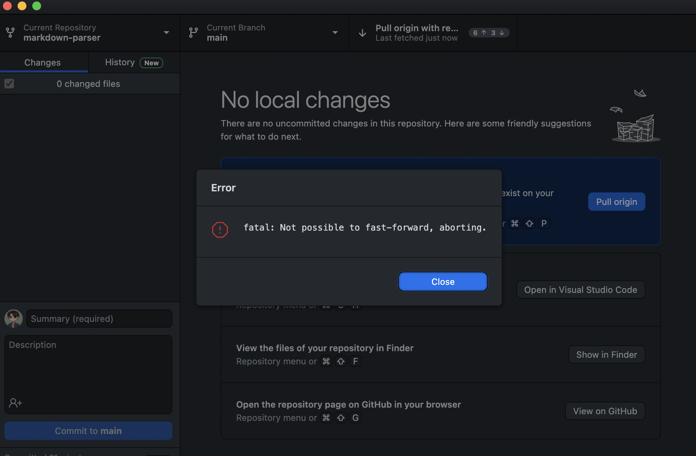

I couldn't get the screenshots or update my Github for the labs because I got an error running it. 

  
 The bug is that the while loop is checking the test-file (failure-inducing input) even after the text ran out. So it will continuously check empty spaces until it returns an OutofMemory error (the symptom).

Another bug is that the file does not differentiate between a link and an image in test-file