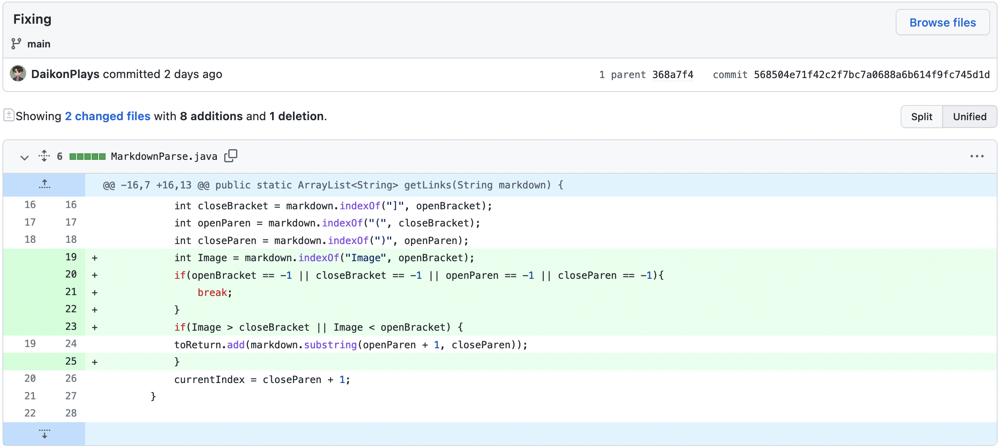

 

Another bug is that the file does not differentiate between a link and an image in test-file.md. Therefore, it will add the image to the array when it shoudln't include it.

Another bug is that when checking the test-file.md when there is no link, it will return an IndexOutofBoundsException (the symptom). This is because the program does not receive any elements for the array.