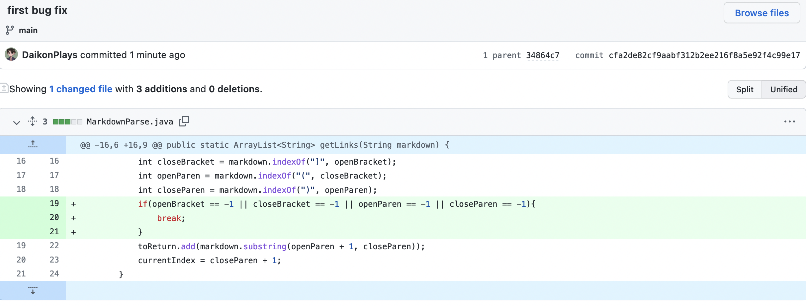
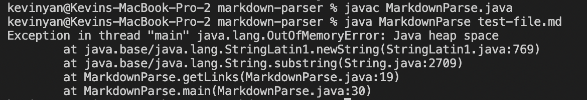

 
[Link to first test file](https://github.com/DaikonPlays/markdown-parser/blob/main/test-file.md)

The first error happens when there are extra space after the URL. This results in an infinite loop and will throw an outofmemory exception, which is resolved by breaking the while loop when there are no more brackets or parenthesis.

Another bug is that the file does not differentiate between a link and an image in test-file.md. Therefore, it will add the image to the array when it shoudln't include it.

Another bug is that when checking the test-file.md when there is no link, it will return an IndexOutofBoundsException (the symptom). This is because the program does not receive any elements for the array.