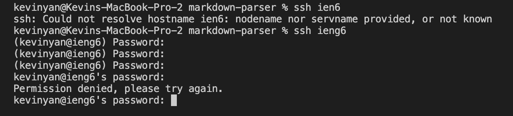
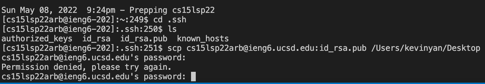

I got an error when trying to ssh using the config file and couldn't figure out how to fix it, so I skipped this part.

This is the public key in my GitHub

The same thing is happening for the server ssh key, so I decided not to do part 3 because scp is clearly not working for some reason. 