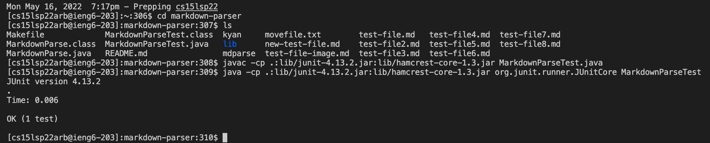

I used MacOS's built-in text editor app

This is the ssh command I used to run the config file. 

I moved movefile.txt using the kyan alias

This is the public key in Github

This is the private key in my user account

This is the git commit push I used.
[Here](https://github.com/DaikonPlays/markdown-parser/commit/63496845a6d905fe39d12f0f6ff361b9cf75a834) is the commit history for that commit.

Here is the scp running

Here is me sshing after running scp

Here is an output of running the tests through ieng6 and the test passing

This is the all the steps for scp running in one line of code.
