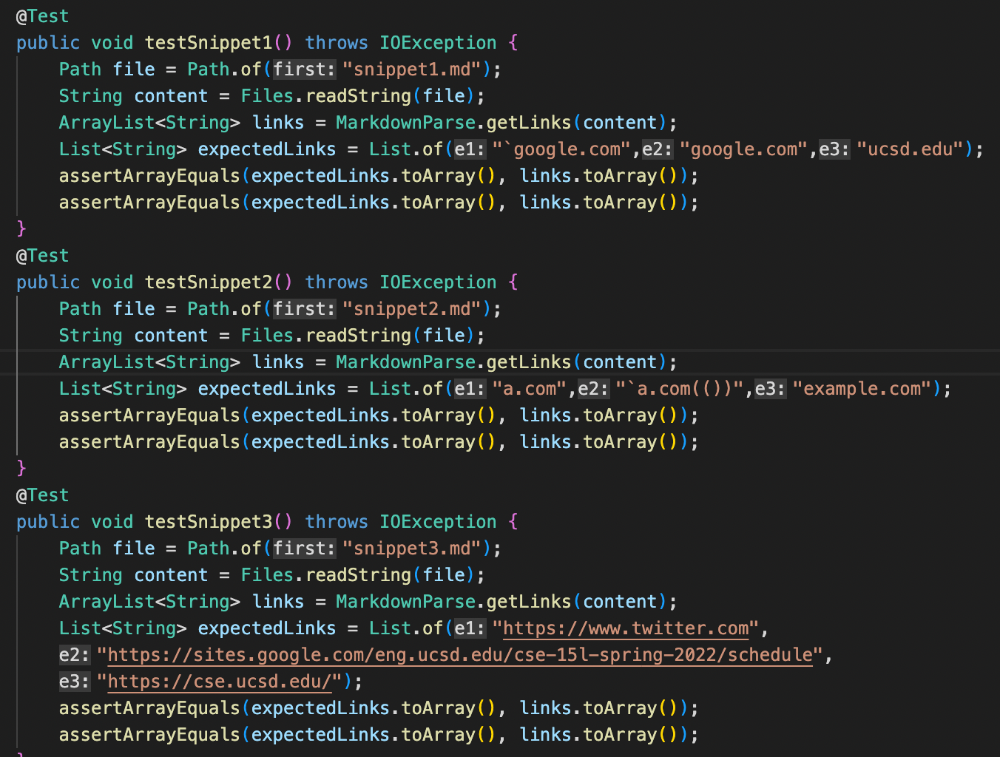
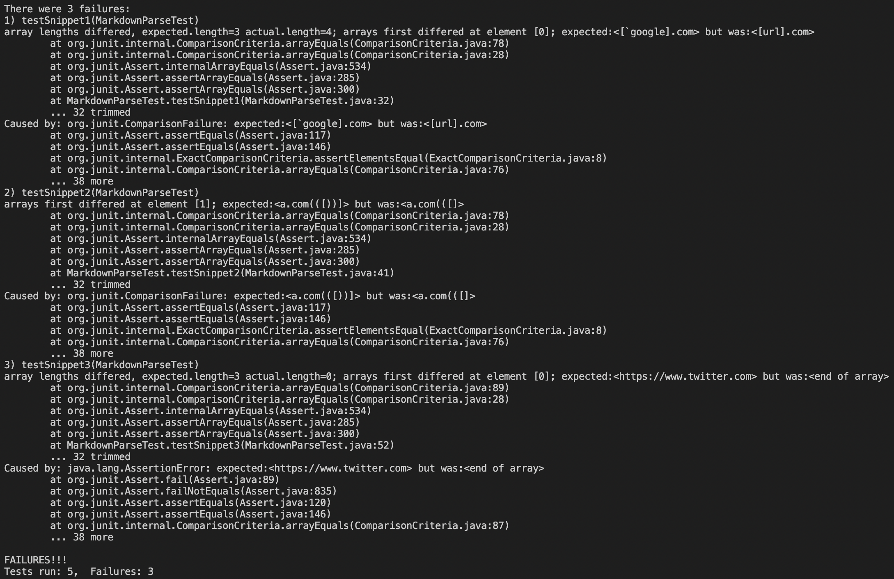
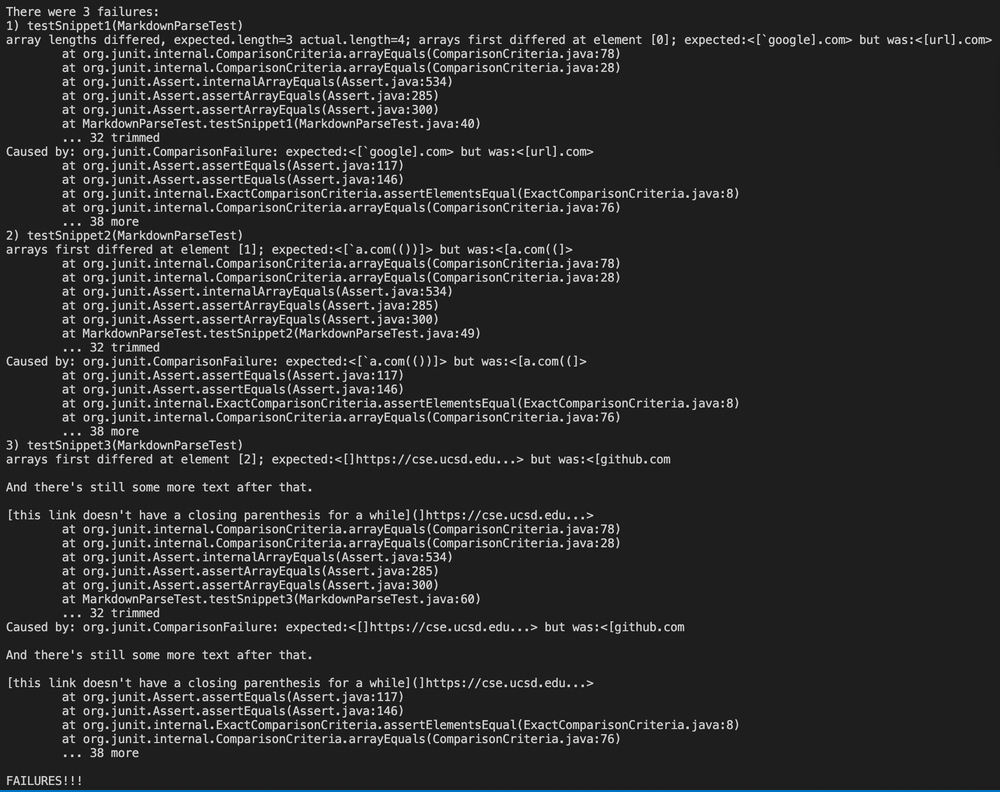

[My repo](https://github.com/DaikonPlays/markdown-parser)

[Lab 7 repo](https://github.com/ezh247467/markdown-parser)

These tests were made using the snippets. 
The expected output for snippit one is [`google.com, google.com, ucsd.edu]

The expected output for snippet two is [a.com, `a.com(()), example.com]

The expected output for snippet three is [https://www.twitter.com, https://sites.google.com/eng.ucsd.edu/cse-15l-spring-2022/schedule, https://cse.ucsd.edu/]

These tests are from my MarkdownParse

These tests are from the MarkdownParse given in lab 7.

For snippet one, the issue was that it doesn't account for backticks in the formatting for links, so it includes the url.com as a link. To fix this, I believe I could solve this in less than 10 lines by adding an if statement that finds the start and end of backticks and then not count for any links in between them. That way, url.com won't be considered a link. This should take about 5 lines.

For snippet two, there is an issue with the nested parenthesis. The code sees the nested parenthesis and then ends the code early, leaving a half finished link. To fix this, I believe I could search for the last possible parenthesis by separating each line by /n and then using lastIndexOf to find the last ) to get the link. This should take under 10 lines. 

For snippet three, the error is caused because it reads the first ] as the last one and ends the code. To fix this, I can employ something similar to snippet two, except I would look for the last index of ] on each line. Then, it would run the code accordingly based on where the last bracket is on each line.