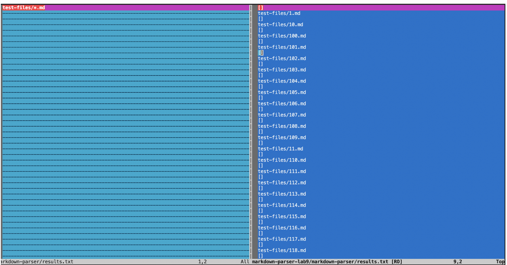

I used vimdiff to find the different tests because it color codes it, making it easier to tell.

However mine was bugged and showed that there was no difference, so I wasn't able to finish the lab. I will do a regrade request.