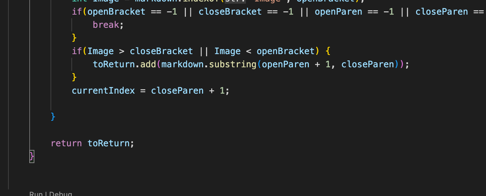

I used vimdiff to find the different tests because it color codes it, making it easier to tell.

[489 test repo](https://github.com/nidhidhamnani/markdown-parser/blob/main/test-files/489.md)
Lab 9 markdownparse is right because I didn't account for new line so it shouldn't be a link.
The expected link is their output. []

I should add more code to check for new lines in the links. If it has a new link in between the link text, no link should be added.

Code should be added in a new line here.

[494 test repo](https://github.com/nidhidhamnani/markdown-parser/blob/main/test-files/494.md)

The lab 9 markdownparse is correct because it should copy the entire line of the link while mine only copies up to the nested parenthesis. 
The expected output is the markdown parse lab 9 output, 

I should add more code at the end to check if there are nested parenthesis. My code currently will continue to treat the parenthesis as the end of a link, so by making code that makes sure the parenthesis nested in is not a link, it should fix the issue.
